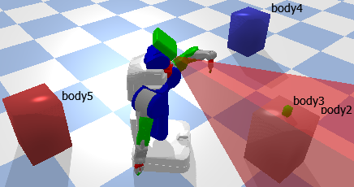
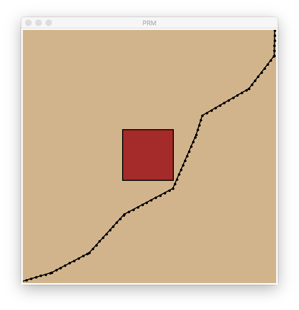

# pddlstream

PDDLStream is a planning framework comprised of an action language and suite of algorithms for Artificial Intelligence (AI) planning in the presence of sampling procedures.
PDDLStream extends Planning Domain Definition Language (PDDL) by introducing streams, declarative specifications of sampling procedures.
PDDLStream algorithms are domain independent and solve PDDLStream problems with only a blackbox description of each sampler.
The motivating application of PDDLStream was for general-purpose robot Task and Motion Planning (TAMP). 

The [default](https://github.com/caelan/pddlstream) **pddlstream** branch ([stable](https://github.com/caelan/pddlstream/tree/stable)) is the newest stable "release" of **pddlstream**.
The [master](https://github.com/caelan/pddlstream/tree/master) **pddlstream** branch is the most recent and advanced version of **pddlstream** but also is somewhat experimental.

<!--https://www.markdownguide.org/basic-syntax/-->
<!--https://github.com/adam-p/markdown-here/wiki/Markdown-Cheatsheet-->

## Publications

* [PDDLStream: Integrating Symbolic Planners and Blackbox Samplers via Optimistic Adaptive Planning](https://arxiv.org/abs/1802.08705
)
<!--* [STRIPStream: Planning In Infinite Domains](https://arxiv.org/abs/1701.00287)-->

## Citation

Caelan R. Garrett, Tomás Lozano-Pérez, Leslie P. Kaelbling. PDDLStream: Integrating Symbolic Planners and Blackbox Samplers via Optimistic Adaptive Planning, International Conference on Automated Planning and Scheduling (ICAPS), 2020.

## Contact

Caelan Garrett: [username]@mit.edu

## History

PDDLStream is the "third version" of the PDDLStream/STRIPStream planning framework, intended to supersede previous versions:

1) https://github.com/caelan/stripstream
2) https://github.com/caelan/ss

PDDLStream makes several representational and algorithmic improvements over these versions.
Most notably, it adheres to PDDL conventions and syntax whenever possible and contains several new algorithms. 
<!--An implementation of STRIPStream that uses PDDL for the specifiation of actions and streams.-->
<!--https://github.com/caelan/pddlstream/compare/master...stable-->

## Installation

<!--$ git clone --recursive --branch downward https://github.com/caelan/pddlstream.git-->
```
$ git clone --recursive --branch downward git@github.com:caelan/pddlstream.git
$ cd pddlstream
$ git submodule update --init --recursive
$ ./downward/build.py
```
<!--```
$ git clone --recursive https://github.com/caelan/pddlstream.git

If building fails, install FastDownward's dependencies using your package manager:
* APT (Linux): `$ sudo apt-get install cmake g++ g++-multilib make python`
<!--* Homebrew (OS X): TBD
* MacPorts (OS X): TBD
* N/A (Windows): install each dependency manually-->

If necessary, see FastDownward's [documentation](http://www.fast-downward.org/ObtainingAndRunningFastDownward) for more detailed installation instructions.

My FastDownward "fork" is several years old. If you have trouble compiling FastDownward on a newer machine, try installing the experimental [downward](https://github.com/caelan/pddlstream/tree/downward) PDDLStream branch.

PDDLStream actively supports python2.7 as well as the most recent version of python3.
<!--(many robotics applications still require python2.7)-->

Make sure to recursively update **pddlstream**'s submodules when pulling new commits.
```
pddlstream$ git pull --recurse-submodules
```

## Examples

This repository contains several robotic and non-robotic PDDLStream example domains.

### PyBullet

Install PyBullet on OS X or Linux using: 
```
$ pip install pybullet numpy scipy
```

Examples:
* PR2 TAMP: `pddlstream$ python -m examples.pybullet.tamp.run`
* PR2 Cleaning and Cooking: `pddlstream$ python -m examples.pybullet.pr2.run`
* Turtlebot Rovers: `pddlstream$ python -m examples.pybullet.turtlebot_rovers.run`
* PR2 Rovers: `pddlstream$ python -m examples.pybullet.pr2_rovers.run`
* PR2 Planning and Execution: `pddlstream$ python -m examples.pybullet.pr2_belief.run`
* Kuka Cleaning and Cooking: `pddlstream$ python -m examples.pybullet.kuka.run`
<!--* Turtlebot NAMO: `pddlstream$ python -m examples.pybullet.namo.run`-->
<!--
* Turtlebot Multi-Robot: `pddlstream$ python -m examples.pybullet.turtlebots.run`
Requires Temporal FastDownward - https://github.com/caelan/TemporalFastDownward
-->

<!--[](https://www.youtube.com/watch?v=3HJrkgIGK7c)-->
[](https://www.youtube.com/watch?v=Uc0fogLsPMI)
&emsp;[](https://www.youtube.com/watch?v=HVD8SpmguYs)
&emsp;[](https://www.youtube.com/watch?v=oWr6m12nXcM)

&emsp;[](https://www.youtube.com/watch?v=XcxsU0VuRUI)
&emsp;[](https://www.youtube.com/watch?v=3HJrkgIGK7c)

See https://github.com/caelan/pybullet-planning for more information about my PyBullet planning primitives library.

### Python TKinter

Install numpy and Python TKinter on Linux using: 
```
$ sudo apt-get install python-tk
$ pip install numpy
```

Examples:
* 1D Continuous TAMP: `pddlstream$ python -m examples.continuous_tamp.run`
* 2D Motion Planning: `pddlstream$ python -m examples.motion.run`
* Discrete TAMP: `pddlstream$ python -m examples.discrete_tamp.run`
* Discrete TAMP with pushing: `pddlstream$ python -m examples.discrete_tamp.run`

&emsp;&emsp;

### Pure Python

Simple examples that can be run without additional dependencies:
* Blocksworld: `pddlstream$ python -m examples.blocksworld.run`
* Blocksworld with Derived Predicates: `pddlstream$ python -m examples.blocksworld.run_derived`
* Kitchen (debug streams): `pddlstream$ python -m examples.kitchen.run`

<!--* Discrete Belief: `pddlstream$ python -m examples.table_obs.run`
* Discrete Belief Space: `pddlstream$ python -m examples.discrete_belief.run`
`$ pip install numpy scipy`-->

### Advanced Functionality

Test cases or advanced (and undocumented) functionality:
* Action Description Language (ADL): `pddlstream$ python -m examples.advanced.adl.run`
* Deferred streams (postponed evaluation): `pddlstream$ python -m examples.advanced.defer.run`
* Exogenous streams (observations): `pddlstream$ python -m examples.advanced.exogenous.run`
* Fluent streams (state constraints): `pddlstream$ python -m examples.advanced.fluent.run`
* Constraint satisfaction: `pddlstream$ python -m examples.advanced.satisfy.run`
* Wild streams (ad hoc certification): `pddlstream$ python -m examples.advanced.wild.run`

### International Planning Competition (IPC)

Unmodified PDDL IPC examples solved using PDDLStream's modified translator:
* Rovers: `pddlstream$ python -m examples.ipc.rovers.run`
* Satellites: `pddlstream$ python -m examples.ipc.satellites.run`

## Applications

External projects that make use of PDDLStream:
* Online TAMP - https://github.com/caelan/SS-Replan
* Automated Construction - https://github.com/caelan/pb-construction
* Learning + TAMP (LTAMP) - https://github.com/caelan/LTAMP
<!--https://github.com/rachelholladay/ftamp-->

## Algorithms

PDDLStream is a planning framework comprised of a **single** planning language but **multiple** planning algorithms.
Some of the algorithms are radically different than others (e.g. Incremental vs Focused) and thus the planning time can also substantially vary.
The **Adaptive** algorithm typically performs best for domains with many possible sampling pathways, such as robot manipulation domains.
<!--For domains with few sampling pathways, the **Incremental** algorithm typically performs best (link to specific examples)-->

The meta procedure [solve(...)](https://github.com/caelan/pddlstream/blob/da1e52aeeff9a22ef647e95b617dd71904cdbe49/pddlstream/algorithms/meta.py#L37) allows the user to toggle between avaliable algorithms using the keyword argument **algorithm={}**.

Property descriptions:
* **Method**: the python function that calls the algorithm
<!--* **Subroutine**: TBD-->
* **Negated streams**: whether the algorithm supports inverting test streams
* **Fluent streams**: whether the algorithm supports fluent streams that additionally condition on the fluent state
* **Wild streams**: whether the algorithm supports streams that additionally can certify ad hoc facts
<!--* **Semantic attachments (SA)**: TBD-->

### Adaptive

* **Method**: [solve_adaptive(...)](https://github.com/caelan/pddlstream/blob/da1e52aeeff9a22ef647e95b617dd71904cdbe49/pddlstream/algorithms/focused.py#L229)
* **Negated streams**: supported 
* **Fluent streams**: supported 
* **Wild streams**: supported 
<!--* **Semantic attachments (SA)**: TBD-->

### Binding

* **Method**: [solve_binding(...)](https://github.com/caelan/pddlstream/blob/da1e52aeeff9a22ef647e95b617dd71904cdbe49/pddlstream/algorithms/focused.py#L215)
* **Negated streams**: supported 
* **Fluent streams**: supported 
* **Wild streams**: supported 
<!--* **Semantic attachments (SA)**: TBD-->

### Focused

* **Method**: [solve_focused_original(...)](https://github.com/caelan/pddlstream/blob/da1e52aeeff9a22ef647e95b617dd71904cdbe49/pddlstream/algorithms/focused.py#L201)
* **Negated streams**: supported 
* **Fluent streams**: supported 
* **Wild streams**: supported 
<!--* **Semantic attachments (SA)**: TBD-->

### Incremental

* **Method**: [solve_incremental(...)](https://github.com/caelan/pddlstream/blob/da1e52aeeff9a22ef647e95b617dd71904cdbe49/pddlstream/algorithms/incremental.py#L700)
* **Negated streams**: not supported 
* **Fluent streams**: not supported 
* **Wild streams**: supported 
<!--* **Semantic attachments (SA)**: TBD-->

## Search Subroutines

Many (but not all) **pddlstream** algorithms have a discrete planning phase that can be implemented using any finite state-space search algorithm, such as Breadth-First Search (BFS) and Uniform-Cost Search (UCS).
However, because **pddlstream** extends PDDL, this planning phase can also be implemented by state-of-the-art classical planning algorithms, which leverage the factored structure of action languages such as PDDL to vastly improve empirical planning efficiency.
Best-first heuristic search algorithms, which automatically derive heursitics in a *domain-independent* manner, are one example class of these algorithms.

### FastDownward

**pddlstream** comes pre-packaged with [FastDownward](http://www.fast-downward.org/), a prolific library that contains many best-first heuristic search PDDL planning algorithms.
I've preconfigured a small number of effective and general search algorithms in [SEARCH_OPTIONS](https://github.com/caelan/pddlstream/blob/4914667a13a80831cadaf115a70938e9f93b021e/pddlstream/algorithms/downward.py#L81), which can be toggled using the keyword argument [planner=?](https://github.com/caelan/pddlstream/blob/4914667a13a80831cadaf115a70938e9f93b021e/pddlstream/algorithms/downward.py#L391). I've roughly ranked them in order of least lazy (lowest cost) to most lazy (lowest runtime):
* [Dijkstra/Uniform-Cost Search (UCS)](https://github.com/caelan/pddlstream/blob/4914667a13a80831cadaf115a70938e9f93b021e/pddlstream/algorithms/downward.py#L87) - optimal but slowest
* [hmax A*](https://github.com/caelan/pddlstream/blob/4914667a13a80831cadaf115a70938e9f93b021e/pddlstream/algorithms/downward.py#L91) - optimal but slow
* [lmcut A*](https://github.com/caelan/pddlstream/blob/4914667a13a80831cadaf115a70938e9f93b021e/pddlstream/algorithms/downward.py#L93) - optimal but slow
* [ff eager astar](https://github.com/caelan/pddlstream/blob/4914667a13a80831cadaf115a70938e9f93b021e/pddlstream/algorithms/downward.py#L97)
* [ff eager {1,...,5} weighted astar](https://github.com/caelan/pddlstream/blob/4914667a13a80831cadaf115a70938e9f93b021e/pddlstream/algorithms/downward.py#L138) - recommended (w=2)
* [ff lazy {1,...,5} weighted astar](https://github.com/caelan/pddlstream/blob/4914667a13a80831cadaf115a70938e9f93b021e/pddlstream/algorithms/downward.py#L129)
* [ff eager greedy](https://github.com/caelan/pddlstream/blob/4914667a13a80831cadaf115a70938e9f93b021e/pddlstream/algorithms/downward.py#L99)
* [ff lazy greedy](https://github.com/caelan/pddlstream/blob/4914667a13a80831cadaf115a70938e9f93b021e/pddlstream/algorithms/downward.py#L103)

The runtime of the discrete planning phase varies depending on the selected search algorithm.
For many non-adversarial problems, these algorithms will either solve a problem instantenously or, if they aren't greedy enough, not terminate within 10 minutes.
I recommend starting with a greedier configuration and moving torward a less greedy one if desired. 

### Other PDDL Planners

Any PDDL planning algorithm could be used in the place of [FastDownward](http://www.fast-downward.org/); however, a caveat is that some of these planners are only implemented to support a limited set of representational features (e.g. no conditional effects, no derived predicates, etc.), which can make both modeling more difficult and ultimately planning less efficient in many real-world (non-IPC) planning domains.
While I heavily recommend [FastDownward](http://www.fast-downward.org/), some PDDL planners that I've interfaced with in the past with some success include:

Classical Planners
* [FastDownward](http://www.fast-downward.org/)
* [FastForward](https://github.com/caelan/FastForward-X)
* [pyplanners](https://github.com/caelan/pyplanners)
* [Cerberus](https://github.com/ctpelok77/fd-red-black-postipc2018)
* [LAPTK](https://github.com/LAPKT-dev/LAPKT-public/)
* [YSHAP](https://github.com/nojhan/descarwin) <!--https://github.com/aldukeman/yahsp2-->
<!--* [pyperplan](https://github.com/aibasel/pyperplan)-->
<!-- https://github.mit.edu/caelan/stripstream/tree/master/stripstream/algorithms/search -->
<!-- https://github.mit.edu/caelan/ss/tree/master/ss/algorithms -->

Numeric Planners:
* [Metric FF](https://github.com/caelan/Metric-FF)
* [SMTPlan](https://github.com/KCL-Planning/SMTPlan)

Temporal Planners:
* [Temporal FastDownward](https://github.com/caelan/TemporalFastDownward)
* [TPSHE](https://github.com/aig-upf/temporal-planning)

Diverse Planners:
* [Forbid Iterative](https://github.com/IBM/forbiditerative)
* [kstar](https://github.com/ctpelok77/kstar)
* [symk](https://github.com/speckdavid/symk)

<!-- International Planning Competition (IPC) -->

## Resources

* [Recent Talk](https://youtu.be/YfCh5qMYGuQ)
* [Recent Overview](https://youtu.be/7xLPogztQss)
* [Recent Tutorial](https://youtu.be/JNOk1rylDpU)
* [PDDLStream Tutorial](https://web.mit.edu/caelan/www/presentations/6.881_19-11-12.pdf)
* [Planning Domain Definition Language (PDDL)](http://users.cecs.anu.edu.au/~patrik/pddlman/writing.html)
* [Derived Predicates](https://www.cs.cmu.edu/afs/cs/project/jair/pub/volume28/coles07a-html/node18.html)
* [FastDownward](http://www.fast-downward.org/)
<!--* [PDDLStream Tutorial](https://web.mit.edu/caelan/www/presentations/6.881_TAMP.pdf)-->

## Retired

"Retired" folders indicate code that no longer is continuously supported and thus is likely outdated.

### Drake

Install Drake on OS X or Ubuntu by following the following instructions: http://drake.mit.edu/installation.html.

Alternatively, install Drake through docker by following the following instructions: http://manipulation.csail.mit.edu/install_drake_docker.html. Use the appropriate docker_run_bash script with docker tag drake-20181128.

Examples:
* Kuka IIWA task and motion planning: `~/pddlstream$ python -m examples.drake.run`
<!--[](https://www.youtube.com/watch?v=3HJrkgIGK7c)-->


Additional PDDLStream + Drake examples can be found at: https://github.com/RobotLocomotion/6-881-examples.

<!--https://drake.mit.edu/gallery.html#task-and-motion-planning-->
